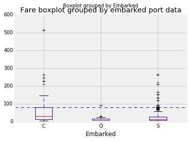
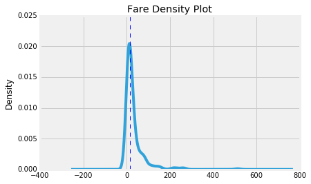
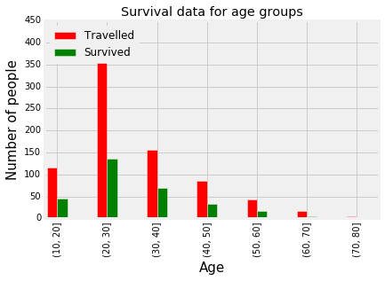
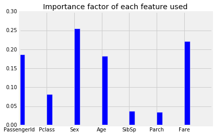

###Titanic Disaster data - analysis [Data from Kaggle]

```python
copy_df.head()
```


<div>
<table border="1" class="dataframe">
  <thead>
    <tr style="text-align: right;">
      <th></th>
      <th>PassengerId</th>
      <th>Survived</th>
      <th>Pclass</th>
      <th>Name</th>
      <th>Sex</th>
      <th>Age</th>
      <th>SibSp</th>
      <th>Parch</th>
      <th>Ticket</th>
      <th>Fare</th>
      <th>Cabin</th>
      <th>Embarked</th>
    </tr>
  </thead>
  <tbody>
    <tr>
      <th>0</th>
      <td>1</td>
      <td>0</td>
      <td>3</td>
      <td>Braund, Mr. Owen Harris</td>
      <td>male</td>
      <td>22</td>
      <td>1</td>
      <td>0</td>
      <td>A/5 21171</td>
      <td>7.2500</td>
      <td>NaN</td>
      <td>S</td>
    </tr>
    <tr>
      <th>1</th>
      <td>2</td>
      <td>1</td>
      <td>1</td>
      <td>Cumings, Mrs. John Bradley (Florence Briggs Th...</td>
      <td>female</td>
      <td>38</td>
      <td>1</td>
      <td>0</td>
      <td>PC 17599</td>
      <td>71.2833</td>
      <td>C85</td>
      <td>C</td>
    </tr>
    <tr>
      <th>2</th>
      <td>3</td>
      <td>1</td>
      <td>3</td>
      <td>Heikkinen, Miss. Laina</td>
      <td>female</td>
      <td>26</td>
      <td>0</td>
      <td>0</td>
      <td>STON/O2. 3101282</td>
      <td>7.9250</td>
      <td>NaN</td>
      <td>S</td>
    </tr>
    <tr>
      <th>3</th>
      <td>4</td>
      <td>1</td>
      <td>1</td>
      <td>Futrelle, Mrs. Jacques Heath (Lily May Peel)</td>
      <td>female</td>
      <td>35</td>
      <td>1</td>
      <td>0</td>
      <td>113803</td>
      <td>53.1000</td>
      <td>C123</td>
      <td>S</td>
    </tr>
    <tr>
      <th>4</th>
      <td>5</td>
      <td>0</td>
      <td>3</td>
      <td>Allen, Mr. William Henry</td>
      <td>male</td>
      <td>35</td>
      <td>0</td>
      <td>0</td>
      <td>373450</td>
      <td>8.0500</td>
      <td>NaN</td>
      <td>S</td>
    </tr>
  </tbody>
</table>
</div>


#### Survival based on Gender - Higher ration of female survived the disaster.


#### Filling missing data for Embarked port field using the port name that is nearer to the mean of the fare for each port. In this case Fare of 80 is nearer to port C.


<div>
<table border="1" class="dataframe">
  <thead>
    <tr style="text-align: right;">
      <th></th>
      <th>PassengerId</th>
      <th>Survived</th>
      <th>Pclass</th>
      <th>Name</th>
      <th>Sex</th>
      <th>Age</th>
      <th>SibSp</th>
      <th>Parch</th>
      <th>Ticket</th>
      <th>Fare</th>
      <th>Cabin</th>
      <th>Embarked</th>
    </tr>
  </thead>
  <tbody>
    <tr>
      <th>61</th>
      <td>62</td>
      <td>1</td>
      <td>1</td>
      <td>Icard, Miss. Amelie</td>
      <td>female</td>
      <td>38</td>
      <td>0</td>
      <td>0</td>
      <td>113572</td>
      <td>80</td>
      <td>B28</td>
      <td>NaN</td>
    </tr>
    <tr>
      <th>829</th>
      <td>830</td>
      <td>1</td>
      <td>1</td>
      <td>Stone, Mrs. George Nelson (Martha Evelyn)</td>
      <td>female</td>
      <td>62</td>
      <td>0</td>
      <td>0</td>
      <td>113572</td>
      <td>80</td>
      <td>B28</td>
      <td>NaN</td>
    </tr>
  </tbody>
</table>
</div>




#### Fill missing values for fare using its median data values


    <matplotlib.text.Text at 0x10eb2c150>




#### Survival for different age - groups. Not many people over 60 survived the disaster.



#### Using Random forest classifier to predict whether a person survived the disaster or not. Here X_train and Y_train are the training data. X_test is the test data. 

```python
clf = RandomForestClassifier(n_jobs=100)
clf.fit(X_train, Y_train)
```





```python
pred = pd.DataFrame()
pred['PassengerId'] = X_test['PassengerId']
pred['Survived'] = clf.predict(X_test)
pred.to_csv('submission_random_forest.csv', index = False)

print 'Got 70.33% accuracy using Random Forest Classifier'
```

    Got 70.33% accuracy using Random Forest Classifier

